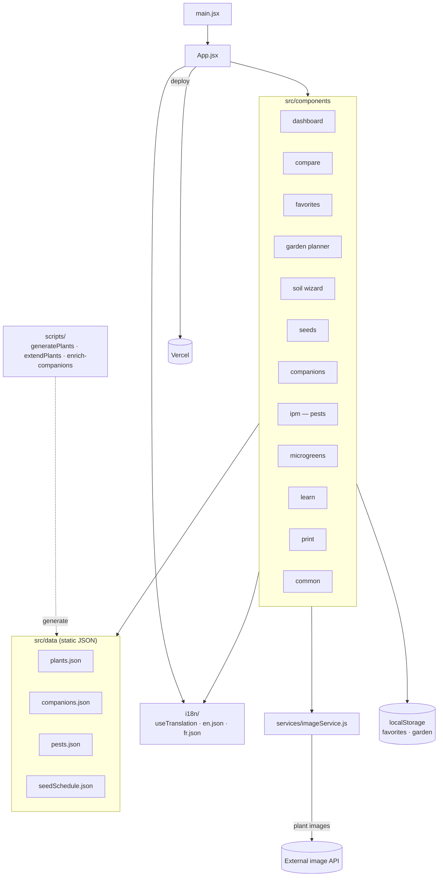

# Architecture

A bilingual (EN/FR) React + Vite single-page app. All data is bundled JSON; user state stays in the browser.

```mermaid
flowchart TD
    Main[main.jsx] --> App[App.jsx]
    App --> I18n["i18n/<br/>useTranslation · en.json · fr.json"]

    subgraph Features["src/components"]
        Dash[dashboard]
        Comp[compare]
        Fav[favorites]
        Gar[garden planner]
        Soil[soil wizard]
        Seeds[seeds]
        Comm[companions]
        IPM[ipm — pests]
        Micro[microgreens]
        Learn[learn]
        Print[print]
        Common[common]
    end

    subgraph Data["src/data (static JSON)"]
        Plants[plants.json]
        Compn[companions.json]
        Pests[pests.json]
        Sched[seedSchedule.json]
    end

    Img[services/imageService.js] -->|plant images| Ext[(External image API)]
    Scripts["scripts/<br/>generatePlants · extendPlants · enrich-companions"] -.generate.-> Data

    App --> Features
    Features --> Data
    Features --> Img
    Features --> LS[(localStorage<br/>favorites · garden)]
    Features --> I18n
    App -->|deploy| Vercel[(Vercel)]
```
